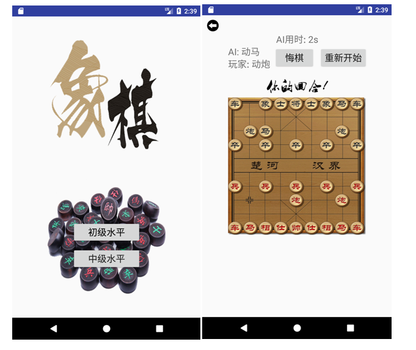

## Android 中国象棋AI
---

**v1.0**

### 实现方式 

(1) 使用a-b剪枝算法

(2) 评估函数： 棋力和棋子的位置

### todo：

(1) 现在的a-b剪枝只能跑到三层(不包括根)，如果跑四层需要花费1分钟左右，三层就可以在10s内跑完。

(2) 添加棋谱：仅使用a-b剪枝很难防范一些套路。我只进行了双炮的识别，当识别到之后会执行四层的a-b剪枝。

**v2.0**

进行了前后端的分离，Android UI访问java服务器获得计算结果，可以在2s之内执行四层的a-b剪枝！五层则需要一分钟左右。

**v3.0**

对节点的数据结构，a-b剪枝的算法实现进行了改进，可以在10s之内完成5层的运算。
